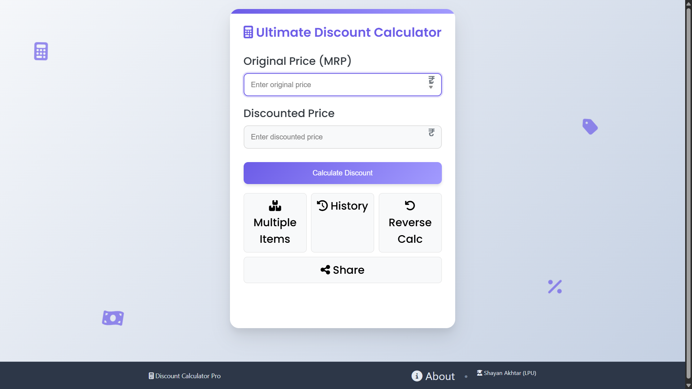

# 💰 Small Business Discount Calculator

**A simple tool for shop owners to calculate & display discounts professionally**  
✔ No more manual percentage calculations  
✔ Customer-friendly discount display  
✔ Supports rounded pricing (e.g., 665 → 600)  
✔ Multiple items discount calculation  

👉 [Live Demo]( https://shayan0786.github.io/BargainPercent-Tool/)

## 🛍️ Who Should Use This?

1. **Small Business Owners**  
   - Who offer discounts but struggle to explain percentages  
   - Want to show "You saved ₹X" transparently  

2. **Shopkeepers with Rounded Pricing**  
   - E.g., When changing ₹665 → ₹600 and need to know exact discount %  

3. **Retail Staff**  
   - Quick calculations during sales  

## ✨ Features

- **Single/Multiple Item Modes**
- **Instant Percentage Calculation**
- **Customer Display Panel** (shows discount clearly)
- **Mobile-Friendly** (works on phones/tablets)
- **Free & No Login Required**

## 🛠️ How to Use

1. Enter original price (e.g., 660)
2. Enter discounted price (e.g., 600)
3. See calculated discount percentage
4. Show the customer display:
